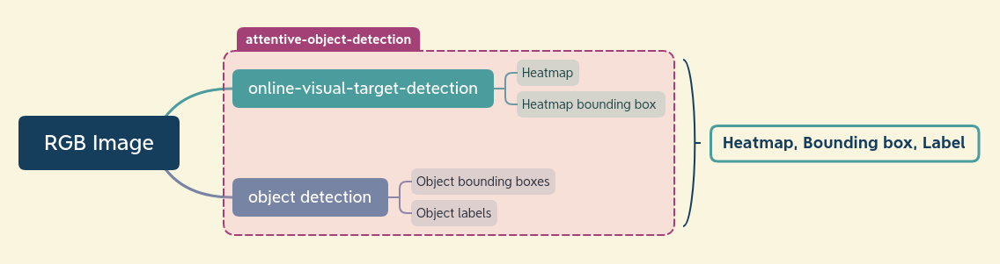

# Attentive Object Detection

The purpose of this project is to enable iCub humanoid to locate and detect the objects in the scene that are visually attended by the human partner. To that end, it will combine the [online-visual-target-detection](https://github.com/shivahanifi/online-visual-target-detection) which provides the visually attended area, and object detection module which specifically detects the objects and labels them.

## Overview
To have a better understanding, consider this general scheme:

[online-visual-target-detection](https://github.com/shivahanifi/online-visual-target-detection) is modified such that it additionally provides the bounding box of the concentrated area in the heatmap. Using this bounding box and comparing it with the output of the object detection module, we will be able to detect the visually attended object.
