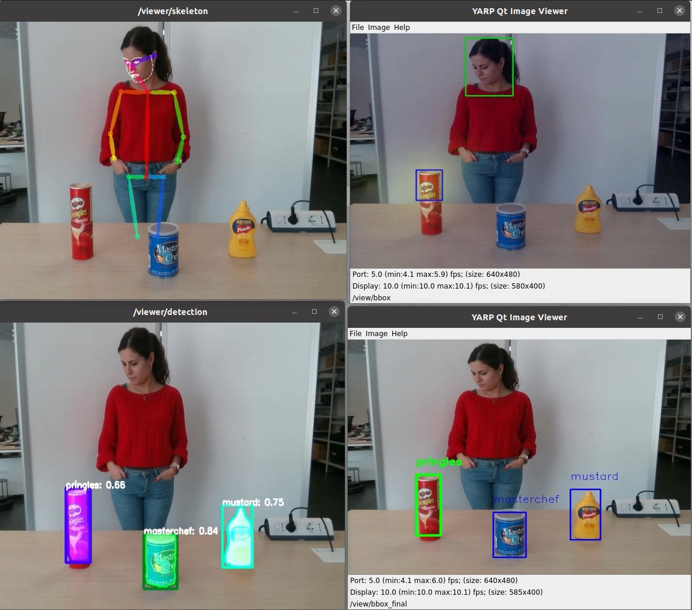

# Tests on icub with AOD module
Here you will find the documentation of several tests on iCub.
## Table of contents
1. [Test 1: Run all modules ](#test-1-run-all-modules)
    - [Observations](#observations)

## Test 1: Run all modules 
This is the first test where all 4 modules, OpenPose, VTD_bbox, Object detection and AOD run together.

Steps followed in this test session:
1. Train object detection module with the object you will use (run from the docker on red alieware)
2. run OpenPose on the white alienware
3. run vtd_bbox (run from the docker on red alieware)
4. run aod (run from the docker on red alieware)
5. From the XML application files of each of the modules run only the necessary `yarpview` modules and connect all the ports. (Since we are running everythin online no need to use dataplayer for input data)

There was no error running all the modules together. However, there were some observations and some necessary changes were applied for the better performance.

### Observations

- The `vtd_bbox` module was very slow.

    Scrutnizing the code `vtd_bbox.py` we found 2 sources tht affects the speed. 

    1. Loading the model

        The part of the code which was dealing with loading the model was placed inside the update module, which means it was loading the model for each of the frames it was recieving. However, loading the model once would be enough. Therefore, we moved the related part to the `configure` function so that it will run once.

        ```
        # Load model 
        self.model = ModelSpatial()
        model_dict = self.model.state_dict()
        pretrained_dict = torch.load(self.args.model_weights)
        pretrained_dict = pretrained_dict['model']
        model_dict.update(pretrained_dict)
        self.model.load_state_dict(model_dict)

        self.model.cuda()
        self.model.train(False)
        ```
    2. Bbox information format

        In the code we were changing the format in which we are storing the bbox info 2 times, and this can slow down the code. Instead, we directly replaced the bbox info inside a list.

        ```
        min_x, min_y, max_x, max_y = get_openpose_bbox(poses)
        head_box = [min_x-(max_x-min_x)*0.1, min_y-(max_y-min_y)*0.1, max_x+(max_x-min_x)*0.1, max_y+(max_y-min_y)*0.1]
        ```
    Applying these changes increased the module's speed with 3 frames per second.

    NOTE: Another reason for the low speed was the CPU. Eventhough we were running the object detection and vtd_bbox on separate GPU's but they were still sharing the same CPU, which was used in full capacity. The effect of CPU on speed was obvious and when running only the `vtd_bbox` and not the object detection the frame per second rate was up to 8. To deal with this problem, the docker related to vtd_bbox and aod will be moved to the red alienware, since it has a more powerfull CPU with 16 cores and running the modules separately will affect the speed of the whole process in a good way.

- `vtd_bbox` stucks 

    When there is no heatmap detected the vtd_bbox module stucks and does not provide any output. A workaround should be designed. The recommended idea is to propagate the previous predistions as an output if only one frame is missing the heatmap, but if more than one consequent frame is missing the heatmap, then a message of `No object is visually attended ` can be displayed on the screen.

- OpenPose face keypoints

    Since The keypoints related to the face are not used in the vtd_bbox module, and only the keypoints from the skeleton are needed, disabling the face helped with the speed improvement.

## Result

The result of this test was satisfying, with low error rate.


You can also find the vido of the result: [icub_aod_test1.mp4]()

## Suggestions

For the next test the following changes can be applied:
   
1. Create an application file which covers all the necessary connections and the modules to avoid oppening multiple `yarpmanager`s.
2. Include the code regarding the workaround of vtd_bbox no heatmap problem.
3. Retrain the object detection module with the white wall as the background to have better accuracy.
4. Try the pipeline on the previously collected data.
5. Record the accuracy on predictions and include the computation process into code.