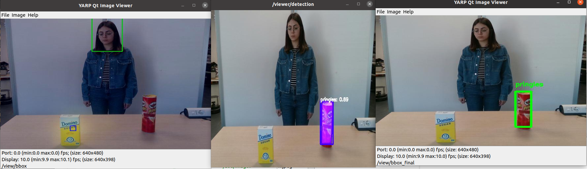
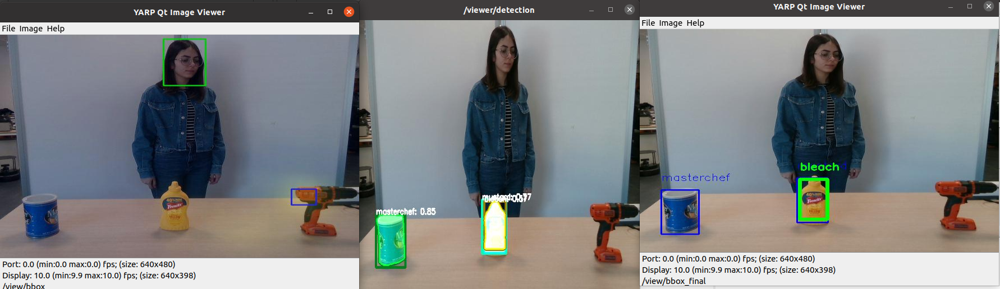
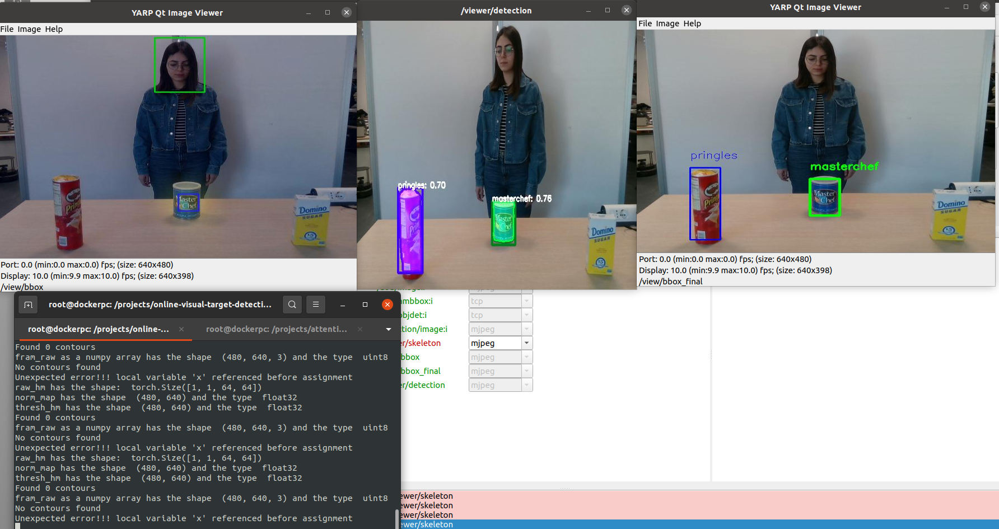

# Tests on icub with AOD module
Here you will find the documentation of several tests on iCub.
## Table of contents
1. [Test 1: Run all modules ](#test-1-run-all-modules)
    - [Observations](#observations)
    - [Result](#result)
    - [Suggestions](#suggestions)
2. [Test 2: Run all modules on dumped data](#test-2-run-all-modules-on-dumped-data)
    - [Experiments](#experiments)
    - [Experiment Guide](#experiment-guide)
    - [Error evaluations](#error-evaluations)

# Test 1: Run all modules 
This is the first test where all 4 modules, OpenPose, VTD_bbox, Object detection and AOD run together.

Steps followed in this test session:
1. Train object detection module with the object you will use (run from the docker on red alieware)
2. run OpenPose on the white alienware
3. run vtd_bbox (run from the docker on red alieware)
4. run aod (run from the docker on red alieware)
5. From the XML application files of each of the modules run only the necessary `yarpview` modules and connect all the ports. (Since we are running everythin online no need to use dataplayer for input data)

There was no error running all the modules together. However, there were some observations and some necessary changes were applied for the better performance.

### Observations

- The `vtd_bbox` module was very slow.

    Scrutnizing the code `vtd_bbox.py` we found 2 sources tht affects the speed. 

    1. Loading the model

        The part of the code which was dealing with loading the model was placed inside the update module, which means it was loading the model for each of the frames it was recieving. However, loading the model once would be enough. Therefore, we moved the related part to the `configure` function so that it will run once.

        ```
        # Load model 
        self.model = ModelSpatial()
        model_dict = self.model.state_dict()
        pretrained_dict = torch.load(self.args.model_weights)
        pretrained_dict = pretrained_dict['model']
        model_dict.update(pretrained_dict)
        self.model.load_state_dict(model_dict)

        self.model.cuda()
        self.model.train(False)
        ```
    2. Bbox information format

        In the code we were changing the format in which we are storing the bbox info 2 times, and this can slow down the code. Instead, we directly replaced the bbox info inside a list.

        ```
        min_x, min_y, max_x, max_y = get_openpose_bbox(poses)
        head_box = [min_x-(max_x-min_x)*0.1, min_y-(max_y-min_y)*0.1, max_x+(max_x-min_x)*0.1, max_y+(max_y-min_y)*0.1]
        ```
    Applying these changes increased the module's speed with 3 frames per second.

    NOTE: Another reason for the low speed was the CPU. Eventhough we were running the object detection and vtd_bbox on separate GPU's but they were still sharing the same CPU, which was used in full capacity. The effect of CPU on speed was obvious and when running only the `vtd_bbox` and not the object detection the frame per second rate was up to 8. To deal with this problem, the docker related to vtd_bbox and aod will be moved to the red alienware, since it has a more powerfull CPU with 16 cores and running the modules separately will affect the speed of the whole process in a good way.

- `vtd_bbox` stucks 

    When there is no heatmap detected the vtd_bbox module stucks and does not provide any output. A workaround should be designed. The recommended idea is to propagate the previous predistions as an output if only one frame is missing the heatmap, but if more than one consequent frame is missing the heatmap, then a message of `No object is visually attended ` can be displayed on the screen.

- OpenPose face keypoints

    Since The keypoints related to the face are not used in the vtd_bbox module, and only the keypoints from the skeleton are needed, disabling the face helped with the speed improvement.

## Result

The result of this test was satisfying, with low error rate.


You can also find the vido of the result: [icub_aod_test1.mp4]()

## Suggestions

For the next test the following changes can be applied:
   
1. Create an application file which covers all the necessary connections and the modules to avoid oppening multiple `yarpmanager`s.
2. Include the code regarding the workaround of vtd_bbox no heatmap problem.
3. Retrain the object detection module with the white wall as the background to have better accuracy.
4. Try the pipeline on the previously collected data.
5. Record the accuracy on predictions and include the computation process into code.

# Test 2: Run all modules on dumped data

Here the goal is to run all the 4 modules with the previously dumped data and get the accuracy.

An XML application file covering all the necessary modules and connections is created. Since the data is going to be dumped for further accuracy measurements, the `aod.py` is also modified such that the selected bbox and class will be provided in an output port.

```
# Output port for selected bbox data
self.out_port_bbox_data = yarp.Port()
self.out_port_bbox_data.open('/aod/bbox:o')
print('{:s} opened'.format('/aod/bbox:o'))
.
.
.
# Output to yarp port- selected bbox data
selected_bbox_data = yarp.Bottle()
selected_bbox_data.addFloat32(selected_obj_bbox[0])
selected_bbox_data.addFloat32(selected_obj_bbox[1])
selected_bbox_data.addFloat32(selected_obj_bbox[2])
selected_bbox_data.addFloat32(selected_obj_bbox[3])
selected_bbox_data.addString(selected_obj_label)
self.out_port_bbox_data.write(selected_bbox_data)
```
## Experiments
For each session and for all the objects the experiments run separately and the accuracy level is documented in [AOD_accuracy](https://docs.google.com/spreadsheets/d/1TIPeJ0koiQdEmuwz81H_2rW8UlA4aqftBUxF0zRzvcQ/edit?usp=sharing) file.

### Experiment Guide
1. Connect the GPUs 
2. Run all the modules: `OpenPose`, `ObjectDetection`, `VTD_bbox`, `AOD`
3. open the folder with the previously dumped images.
4. In the `rgb_input` folder in the `info.log` change the port names to `/dumped/image:o` (That is necessary since OpenPose itself opens the port named `yarpopenpose/propag:o` and yarp cannot have 2 ports with the same name.)
3. modify the application file related to the dumper [aod_dumper.xml](), such that the file names make sense when saved.
3. Run `yarpmanager` with the application file related to the dumpers (Do not connect yet).
4. Run `yarpmanager` with the final application file created for all the modules [experiments.xml]() .
4. In the `yarpdataplayer` window load the folder of images you need. Set the speed to 0.5(lowest), does not play the rgb_output, and does not repeat the images.
5. connet the main xml application [experiments.xml]()
6. run and connect the datadumpers (usually you need to refresh to make sure everything works)
7. play the data
8. when dataplayer is done disconnect the main xml and stop only the dataplayer module, disconnect and stop the dumper xml
9. check the dumped folder in the home direction. and compare the number of frames in the resource folder, the number of frames evaluated and the correctness.
10. move the dumped data to the related folder and delet the created folder since it will be created next time you use the dumper.

### Error evaluations
- Sugarbox

    When there is a sugarbox among the objects, and specifically visually intended, there is an error, since the object detection module fails to detect it correctly and provide the boundingbox information. In this situation only 3 frames out of 54 initial frames are evaluated and all selects the pringles as an output.

    

- Driller & mustard

    The problem with the driller is related to the object detection module. The module does not identify the driller. Therefore, the closest boundingbox is selected, which should be mustard but there is a problem with the label of the object detection and it is classified as the bleach. Here 55 frames out of 58 is evaluated but all of them classified in wrong labels.

    

- `No contours found`
    When the `vtd_bbox ` connot find the visually attended area, it would not creat a heatmap and therefore there will be no contours related to the heatmap. This problem causes an error and prevents the code from running properly. This causes a huge error in the session3 with sugarbox, materchef, pringles and when pringles is attended. Here 0 frames out of 56 frames are evaluated.

    