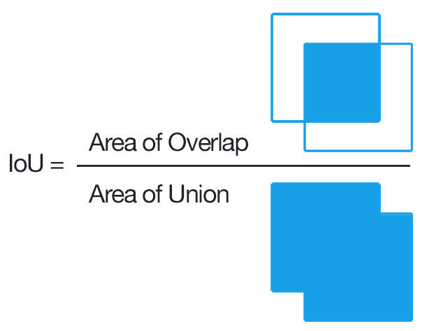

This is a detailed explanation of the module combining the result of `vtd_bbox.py` and object detection module.

## Inputs
3 input ports will be defined. 
- The raw image propagated through the `vtd_bbox` module
- The information of the heatmap bunding box from the `vtd_bbox`
- The information of the Object bounding boxes and labels from object detection module

## Outputs
The output for this module would be the Image and the bounding boxes of all the objects in the scene, with the visually attended object being highlighted.

## Approach
- IoU 

    To decide which object is being visually attended, we will apply the Intersection over Union (IoU) metric. In simple words, we will compare the heatmap bounding box extracted from the `vtd_bbox` with each of the bounding boxes extracted from the object detection module and choose the one with the highest IoU value as the visually attended object.

    

- Object detection output

    Theoutput of the object detection module has the form:
    ```
    -1 0.000000 1608649888.545794 (128.0 286.0 170.0 402.0 0.877657055854797363281 pringles (orangecup mustard pear glass pringles)) (236.0 326.0 273.0 393.0 0.919657945632934570312 glass (orangecup mustard pear glass pringles)) (312.0 423.0 354.0 460.0 0.812700802087783813477 pear (orangecup mustard pear glass pringles)) (421.0 341.0 469.0 439.0 0.747145771980285644531 mustard (orangecup mustard pear glass pringles)) (486.0 359.0 508.0 393.0 0.747145771980285644531 mustard (orangecup mustard pear glass pringles))

    ```
    which is a string containing some values separated by spaces.
    1. index
    2. time indicator
    3. time indicators
    4. Xtl
    5. Ytl
    6. Xbr
    7. Ybr
    8. Confidence
    9. Label
    10. (set of all possible labels)
    
    Since we need the bounding box values and also the label, the code below hhelps to extract the information from the string.

    ```
    obj_det_data_list = [tuple(s.strip().split()) for s in obj_det_data.split(") ") if s.strip()]
    ```

    Here is a breakdown of the line:

    1. `string.split(") ")`: splits the `obj_det_data` string into a list of strings, where each string represents the information about an object detected in an image. The delimiter used for splitting is the closing parenthesis ) followed by a space character.
    2. `if s.strip()`: checks if each string in the list obtained in step 1 is not empty after removing any leading and trailing whitespace characters. This is to filter out any empty strings that might be created by the splitting.
    3. `s.strip().split()`: splits each non-empty string obtained in step 2 into a list of strings, where each string represents an element of the tuple that will be created.
    tuple(...) creates a tuple from the list of strings obtained in step 3.
    4. The entire expression in step 4 is enclosed in square brackets, which creates a list comprehension that iterates over the non-empty strings obtained in step 2, applies the processing steps 3 and 4 to each string, and collects the resulting tuples into a list. The final result is assigned to the variable `obj_det_data_list`.

    In summary, the line of code processes a string that contains information about objects detected in an image and creates a list of tuples, where each tuple contains the coordinates of the bounding box, the confidence score, the class label, and any additional attributes of the detected object. The output will have the form:
    ```
   [  ('128.0', '286.0', '170.0', '402.0', '0.877657055854797363281', 'pringles', '(orangecup', 'mustard', 'pear', 'glass', 'pringles)'),  ('236.0', '326.0', '273.0', '393.0', '0.919657945632934570312', 'glass', '(orangecup', 'mustard', 'pear', 'glass', 'pringles)'),  ('312.0', '423.0', '354.0', '460.0', '0.812700802087783813477', 'pear', '(orangecup', 'mustard', 'pear', 'glass', 'pringles)'),  ('421.0', '341.0', '469.0', '439.0', '0.747145771980285644531', 'mustard', '(orangecup', 'mustard', 'pear', 'glass', 'pringles)'),  ('486.0', '359.0', '508.0', '393.0', '0.747145771980285644531', 'mustard', '(orangecup', 'mustard', 'pear', 'glass', 'pringles)')]
 
    ```


